# dji-cloud-api-drone-inspection-master
无人机巡检系统
# 联系我们 VX：   wsdj1566zhc

# 无人机智能巡检系统

## 1. 项目概述

### 1.1 项目名称

无人机智能巡检系统开发项目

### 1.2 项目背景

传统人工巡检方式存在效率低下、成本高昂、作业风险大等问题，尤其在大型设施（如机场、电力线路、油气管网）的巡检中面临诸多挑战。随着无人机技术、人工智能和物联网的快速发展，无人机智能巡检已成为提升巡检效率、降低运营成本、保障作业安全的理想解决方案。本项目旨在开发一套集实时监控、智能识别、任务管理、数据分析于一体的无人机智能巡检系统，满足现代化巡检工作的需求。

### 1.3 项目目标

- 开发一套完整的无人机智能巡检系统，实现巡检过程的自动化、智能化和可视化
- 集成AI识别功能，实现对异常事件（如人员入侵、设备故障、安全隐患）的实时检测与报警
- 构建统一的数据管理平台，实现巡检数据的集中存储、分析与共享
- 支持多类型无人机和巡检设备的无缝集成，确保系统的兼容性和可扩展性
- 提高巡检效率30%以上，降低人力成本40%，减少安全事故发生率

### 1.4 主要内容

本项目将围绕以下核心内容展开：

- 实时监控与远程控制模块开发
- 智能任务管理系统设计与实现
- AI识别算法集成与事件管理流程开发
- 三维实景建模与空间分析功能实现
- 设备管理与数据同步机制开发
- 系统管理与权限控制模块设计

## 2. 系统功能模块

### 2.1 实时监控与控制模块

- **实时巡检监控**：通过无人机搭载的摄像头实时传输巡检视频，支持多视角切换和高清画质显示

- **设备实时遥测数据**：实时采集无人机的飞行参数（高度、速度、航向）、电池状态、负载设备状态等信息

- **实时AI直播**：结合AI算法对实时视频流进行分析，实时标记异常事件并在视频中叠加显示

- **无人机远程控制**：支持通过地面站对无人机进行远程操控，包括起飞、降落、航线调整等操作

- **负载远程控制**：远程控制无人机搭载的负载设备，如相机变焦、云台调整、传感器参数设置等

- **指点飞行**：通过在地图界面点击目标位置，实现无人机的自主导航飞行

- **在线机场实时监控**：实时监控无人机机场的运行状态、环境参数、设备健康状况

- **在线无人机实时监控**：实时显示所有在线无人机的位置、状态、任务进度等信息

  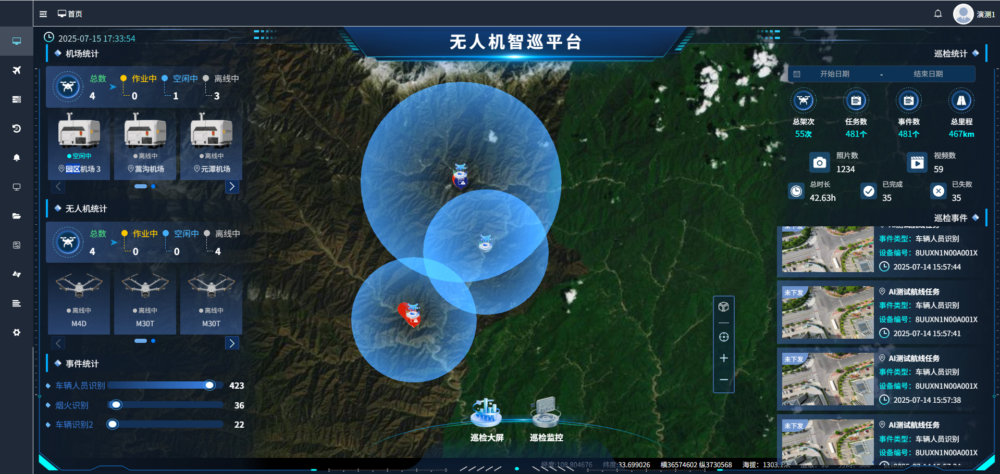 

### 2.2 任务管理模块

- **即时任务**：支持手动创建和下发临时巡检任务，优先级最高

- **定时任务**：可设置按日、周、月等周期自动执行的巡检任务

- **循环任务**：支持设置重复执行的巡检任务，可指定循环次数和间隔时间

- **单兵无人机任务**：针对单个无人机的独立任务管理，支持离线任务模式

- **航线导入、导出、复制**：支持KML、CSV等格式的航线文件导入导出，支持航线模板复制

- **实景三维航线规划**：基于三维实景模型进行航线规划，支持地形跟随和避障设置

- **倾斜摄影面状航线**：自动生成适用于倾斜摄影的网格状航线，支持多角度拍摄设置

- **航点AI算法配置**：允许在特定航点设置AI识别算法参数，实现定点精准检测

  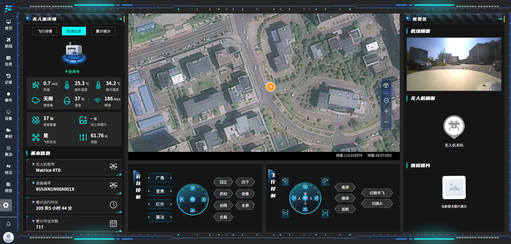 

### 2.3 数据与媒体管理模块

- **巡检照片管理**：集中存储、分类、检索巡检过程中拍摄的照片，支持标签和备注

- **巡检视频管理**：支持视频文件的上传、存储、播放和下载，支持关键帧标记

- **巡检报告查看、导出**：自动生成巡检报告，支持PDF、Excel、Word等格式导出

- **二维正射图管理**：管理通过无人机拍摄生成的二维正射影像，支持缩放、测量等操作

- **三维模型管理**：存储和展示通过倾斜摄影生成的三维模型，支持多角度浏览

- **模型对比功能**：支持不同时期生成的三维模型进行对比分析，检测变化区域

- **照片建模**：支持基于巡检照片生成二维平面图、三维模型和地形模型

- **数据自动上传**：巡检完成后自动将照片、视频和数据上传至云端存储

  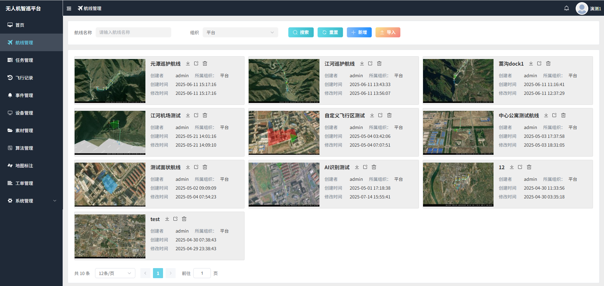 

  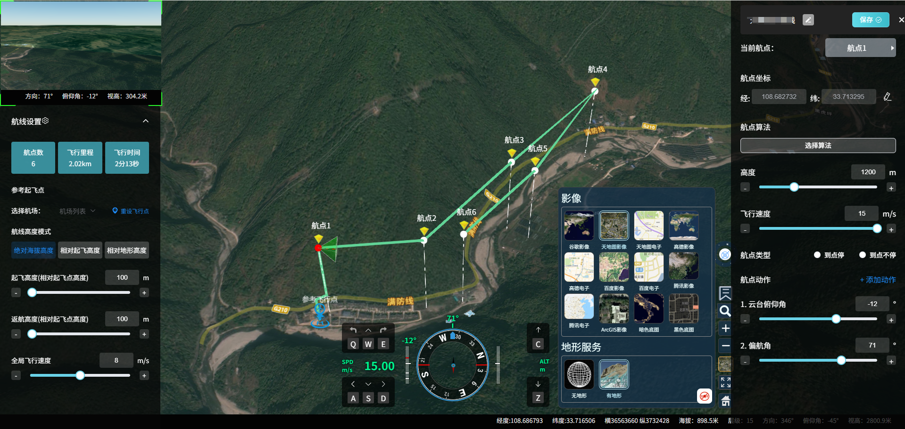 

  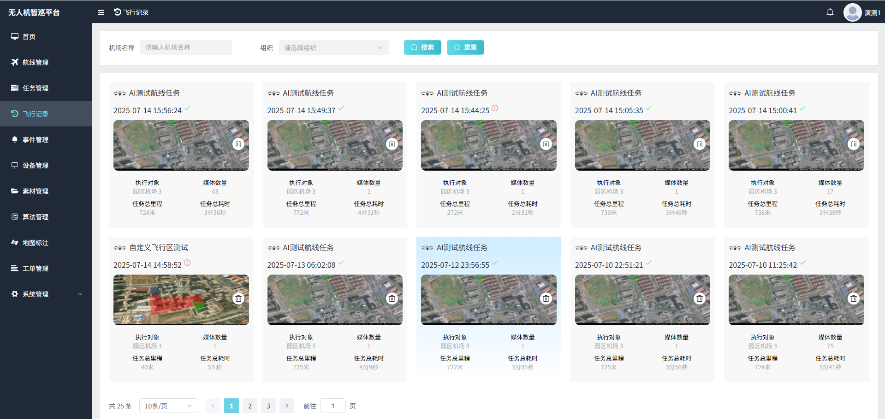 

  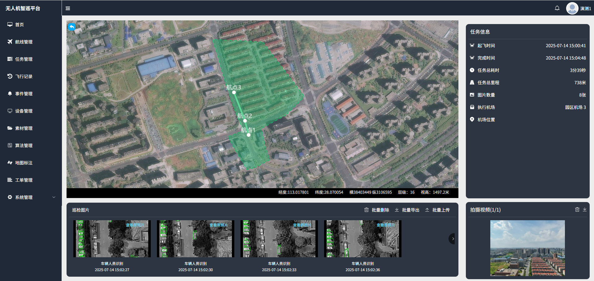 

  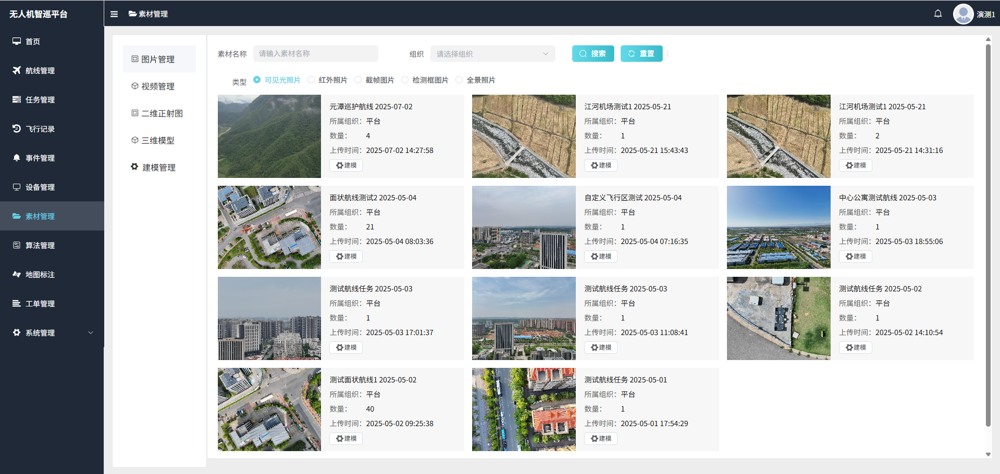 

### 2.4 AI识别与事件管理模块

- **AI识别事件管理**：对AI识别到的异常事件进行统一管理，包括事件类型、位置、严重程度等

- **事件地图分布展示**：在地图上直观展示所有事件的分布位置，支持按类型、时间筛选

- **事件下发、处理**：支持将事件工单下发给相关责任人，跟踪处理进度和结果

- **内置算法**：集成人员、车辆、烟火、垃圾等常见目标的识别算法

- **实时识别拍照**：在实时监控过程中自动对识别到的异常目标进行拍照存档

- **识别视频直播**：支持将AI识别结果叠加到实时视频流中进行直播

- **识别流量统计**：对识别到的目标进行数量统计和趋势分析

- **算法自主飞行控制**：基于AI识别结果自动调整飞行路径，实现重点区域详查

  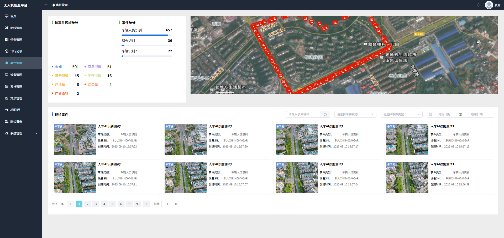 

### 2.5 设备与机场管理模块

- **机场管理**：管理无人机机场的基本信息、位置分布、运行状态

- **无人机管理**：维护无人机的设备档案、飞行记录、维护记录

- **机场远程调试**：支持对远程机场进行参数配置、故障诊断和固件升级

- **机场上云配置**：支持大疆机场1代、2代、3代等设备的上云配置和数据同步

- **无人机直播上云**：将无人机拍摄的实时视频流上传至云端平台，支持多终端访问

- **设备状态展示**：实时展示所有设备的在线状态、健康状况、任务执行情况

- **执行平台下发任务**：接收并执行来自上级管理平台的巡检任务

- **机场分布**：在地图上展示所有机场的分布位置和基本状态

  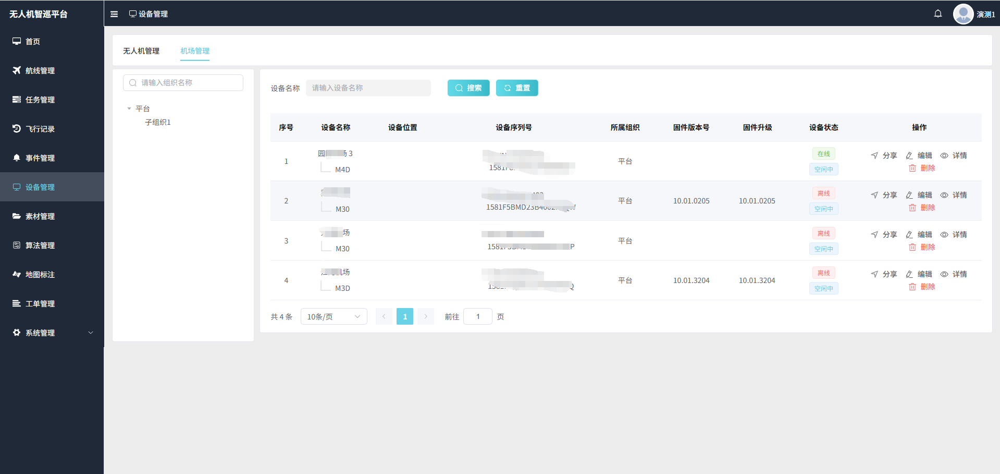 

  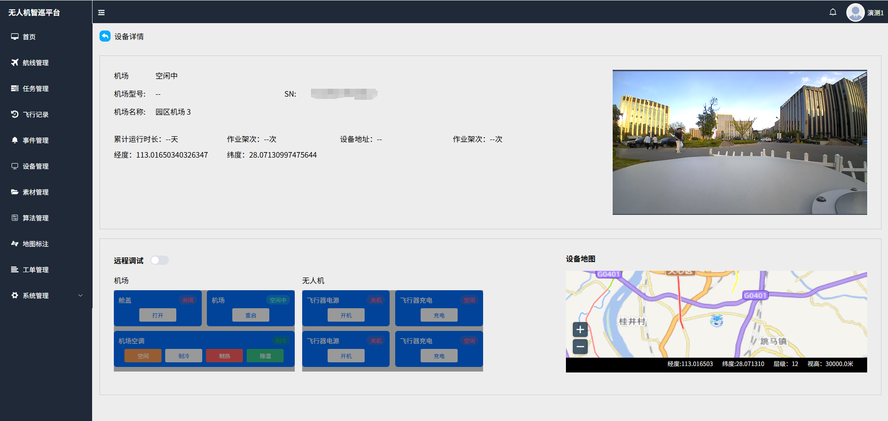 

### 2.6 地图与空间管理模块

- **实景三维呈现**：基于三维模型实现巡检区域的实景可视化展示

- **限飞区显示**：在地图上显示禁飞区、限飞区等空域限制信息

- **点、线、面地图元素标注**：支持在地图上添加标记点、路线、区域等自定义元素

- **自定义飞行区**：允许用户划定特定的飞行区域，限制无人机活动范围

- **自定义限飞区**：支持用户根据需要设置临时或永久限飞区域

- **统计数据可视化**：在地图上以热力图、柱状图等方式展示设备、任务、媒体等统计数据

  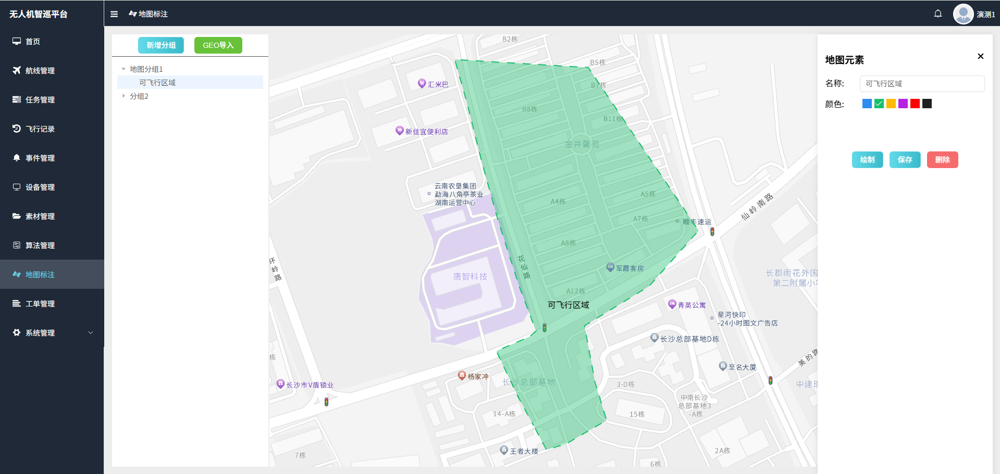 

### 2.7 系统管理模块

- **用户管理**：管理系统用户的创建、删除、权限分配
- **角色管理**：定义不同的用户角色，如管理员、操作员、查看员等
- **组织管理**：支持多级组织结构，实现数据和权限的分级管理
- **菜单管理**：自定义系统菜单的显示和权限控制
- **字典管理**：维护系统中各类代码和参数的标准值
- **审计日志**：记录用户的所有操作行为，确保系统安全和可追溯性

### 2.8 算法管理模块

- **算法列表**：展示系统中所有可用的AI识别算法

- **算法参数设置**：允许用户调整算法的识别阈值、灵敏度等参数

- **添加自定义算法**：支持上传和集成第三方自定义算法

- **AI算法服务**：提供算法的部署、运行和监控服务

- **算法性能统计**：记录和展示各算法的识别准确率、处理速度等性能指标

  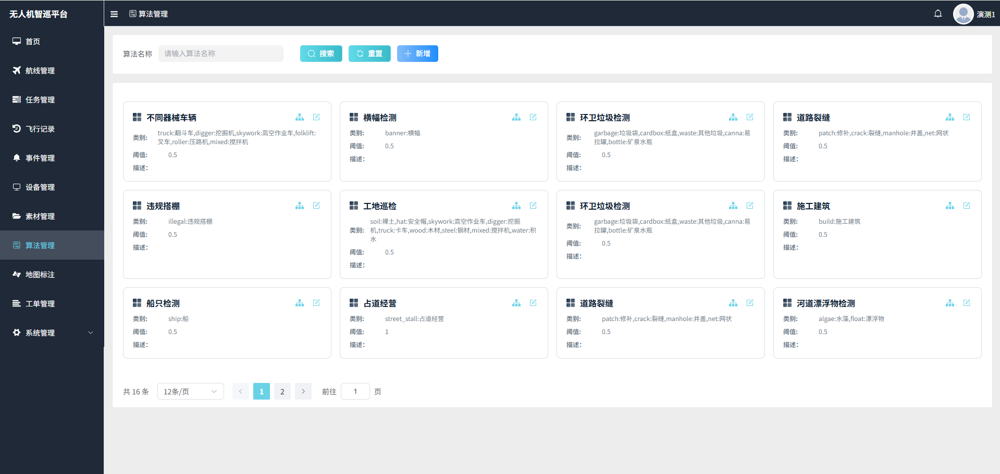 

## 3. 技术方案

### 3.1 系统架构

本系统采用前后端分离的微服务架构，主要包括以下几层：

- **前端层**：基于Vue.js框架开发，采用Element UI组件库，实现响应式界面设计
- **API网关层**：使用Spring Cloud Gateway实现请求路由、负载均衡和认证授权
- **应用服务层**：采用Spring Boot开发微服务，包括用户服务、任务服务、设备服务等
- **数据持久层**：使用MySQL存储结构化数据，MongoDB存储非结构化数据，Redis实现缓存
- **消息队列层**：采用RabbitMQ实现服务间的异步通信和事件驱动
- **AI算法层**：集成TensorFlow深度学习框架，提供目标检测、图像分割等AI能力
- **数据存储层**：采用分布式文件系统MinIO存储海量图片和视频数据

### 3.2 关键技术

- **实时视频传输**：采用WebRTC协议实现低延迟视频流传输，支持H.265编码
- **无人机控制协议**：兼容大疆SDK、MavLink协议，支持主流无人机型号
- **三维可视化**：使用Cesium.js实现三维地球和模型的可视化展示
- **地图服务**：集成高德地图/百度地图API，提供地理编码、路径规划等功能
- **实时数据处理**：采用Spark Streaming实现对无人机遥测数据的实时分析
- **容器化部署**：使用Docker和Kubernetes实现系统的容器化部署和弹性伸缩
- **安全认证**：基于OAuth 2.0和JWT实现用户认证和授权

### 3.3 硬件环境

- **服务器**：采用2台8核16G云服务器，实现负载均衡和高可用
- **存储设备**：配置10TB NAS存储，用于存储巡检数据和媒体文件
- **无人机**：支持大疆Mavic 3、Phantom 4 RTK等主流无人机型号
- **无人机机场**：兼容大疆机场1代、2代、3代等自动化机场设备
- **负载设备**：高清摄像头、热成像相机、气体传感器等

## 4. 结论与展望

### 4.1 项目结论

本无人机智能巡检系统项目通过集成无人机技术、人工智能和物联网技术，能够有效解决传统巡检方式存在的效率低、成本高、风险大等问题。系统功能完善，技术方案可行，实施计划合理，预算可控，具有较高的经济效益和社会效益。项目的成功实施将大幅提升巡检工作的智能化水平，为企业的安全生产和运营管理提供有力支持。

### 4.2 未来展望

- **功能扩展**：计划在后续版本中增加更多AI识别算法，如设备缺陷检测、热力图分析等
- **平台集成**：与企业现有ERP、MES等管理系统进行集成，实现数据共享和业务协同
- **移动端支持**：开发移动端应用，支持在手机和平板上进行任务管理和实时监控
- **5G应用**：结合5G网络，进一步提升实时视频传输质量和远程控制响应速度
- **多机协同**：开发多无人机协同巡检功能，提高大面积区域的巡检效率
